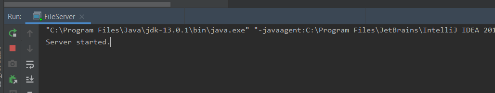

# Introduction  
This is a CLI operated file server. Once installed and run, 
with this server you will have a public location where other users can PUSH - GET - DELETE - LIST - SYNCH their files to, 
using 1 or more FileClients connecting to the FileServer using CLI commands.   

# Installation
To install this Application clone the following link: 
https://github.com/crimsonfyza/AFTP_FileServer.git

To setup the application for the "first use" read #How to use

# How to use 
Run FileServer, FileServer will use port: "25444", make sure this port is available.
If the application says "Server started." the application is running, as shown in the screenshot below. 
   

If the application doesn't run, the port is currently in use. The application will than show the error "Port already in use."

The steps above are the only ones needed to get the application "running"
to connect users you need to use the other application. 
connect the users to the fileservers IP or if on the same computer localhost, if they connect succesfully the fileserver shows the following message for each user that is connected: 

# Security
Every action that a FileClient does is logged in a single row with "Timestamp || socketconnection || input || response". 
this row is logged in the logfile.txt this file if not exist will automatically be created. it will not be empty'd on first run, it will only update.

We at filedevelopers@avans.nl use the "Task scheduler" tool from Microsoft, to run a Powershell check on the logfile.txt, if errors are found it will automatically mail them to filedevelopers@avans.nl for our automated security logging.
The source for the powershell file is in: powershell_script.
It will look like this: 

# Contribute 
Other developers can give us feedback at filedevelopers@avans.nl